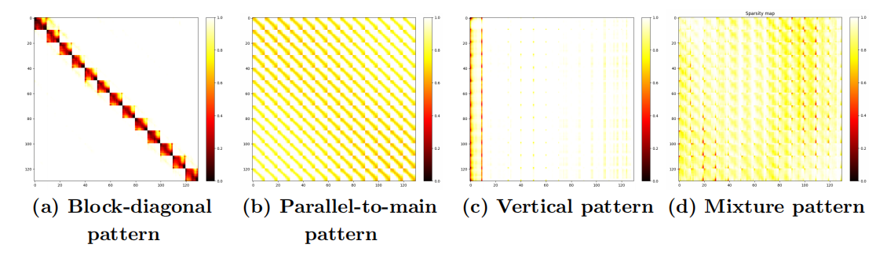

<div align="center">


# MOD-DiT

### Mixture of Distributions Matters: Dynamic Sparse Attention for Efficient Video Diffusion Transformers

[](https://arxiv.org/abs/2601.11641)
[](./LICENSE)
[](https://github.com/pkumelon/MOD-DiT/stargazers)
[](https://www.python.org/)
[](https://pytorch.org/)
[](https://developer.nvidia.com/cuda-toolkit)

**[Yuxi Liu](mailto:yuxiliu666@stu.pku.edu.cn)**<sup>1\*</sup> &nbsp;&nbsp;
**[Yipeng Hu](mailto:2301213082@stu.pku.edu.cn)**<sup>1\*</sup> &nbsp;&nbsp;
**[Zekun Zhang](mailto:2023090909020@std.uestc.edu.cn)**<sup>1\*</sup> &nbsp;&nbsp;
**[Kunze Jiang](mailto:kzejiang@mail.ustc.edu.cn)**<sup>2</sup> &nbsp;&nbsp;
**[Kun Yuan](mailto:kunyuan@pku.edu.cn)**<sup>1†</sup>

<sup>1</sup>Peking University &nbsp;&nbsp;
<sup>2</sup>University of Electronic Science and Technology of China &nbsp;&nbsp;
<sup>3</sup>University of Science and Technology of China

<sub>\* Equal contribution &nbsp;&nbsp; † Corresponding author</sub>

**Training-free · Sampling-free · Plug-and-play · Up to 2.05x speedup**

</div>

---

<!-- TODO: Export Figure 1 from the paper and save it to assets/teaser.png -->
<div align="center">
  <p><em>MOD-DiT achieves a consistent <b>2.05x</b> speedup on HunyuanVideo while keeping the generated videos almost identical to full attention.</em></p>
</div>

---

## Table of Contents

- [News](#news)
- [Highlights](#highlights)
- [Video Comparison](#video-comparison)
- [Method](#method)
- [Installation](#installation)
- [Quick Start](#quick-start)
- [Configuration](#configuration)
- [Project Structure](#project-structure)
- [Acknowledgement](#acknowledgement)
- [Citation](#citation)
- [License](#license)

---

## News
- **[2026-07]** Code released, with support for **HunyuanVideo**, **Wan2.1**, and **CogVideoX-v1.5**.
- **[2026-05]** 🎉 Paper accepted by **ICML 2026**.
- **[2026-01]** Paper released on [arXiv](https://arxiv.org/abs/2601.11641).
---

## Highlights

Video Diffusion Transformers (vDiTs) are bottlenecked by the quadratic cost of 3D self-attention. Existing sparse attention methods either impose **oversimplified static patterns** (fixed vertical grids, exponential decay) or require **expensive online sampling** to obtain dynamic sparsity.

MOD-DiT resolves this dilemma:

- **Sampling-free dynamic sparsity.** Attention masks are predicted from an analytical linear approximation model instead of repeated online sampling, removing the sampling overhead entirely.
- **Training-free and plug-and-play.** MOD-DiT operates fully online at inference time. No finetuning, no retraining, no auxiliary models.
- **Tri-level adaptivity.** Mask patterns *and* sparsity ratios adapt simultaneously across three dimensions: **input**, **attention head**, and **denoising step**. Notably, the denoising-step dimension is overlooked by most prior dynamic methods.
- **Highest sparsity with the best quality.** MOD-DiT simultaneously attains the highest sparsity (**83.23%** on HunyuanVideo), the best PSNR/LPIPS, and the largest speedup among all compared baselines.
- **Negligible overhead.** All additional operations introduced by MOD-DiT account for only about **12%** of a single full-attention latency, measured on VBench prompts.
- **Hardware-friendly.** Block-wise execution enables localized memory access and leverages GPU warp-level parallelism, integrating cleanly with mainstream sparse-attention APIs.

---

## Video Comparison

Side-by-side comparison between the original **full attention** outputs and **MOD-DiT**, generated from identical prompts and seeds. MOD-DiT preserves subject identity, motion smoothness, and texture detail while cutting inference cost substantially.

<!-- TODO: Place the comparison clips under assets/videos/ using the file names below.
     Recommended: 480p-720p GIF (<10 MB each) for inline playback, plus the original MP4 for full quality.
     GitHub renders GIFs inline, but does not autoplay local MP4 files in README tables. -->

### HunyuanVideo — 117 frames, 768x1280, A100

<table>
<tr>
<td width="50%" align="center"><b>Full Attention</b><br><sub>6978 s &nbsp;|&nbsp; 1.00x</sub></td>
<td width="50%" align="center"><b>MOD-DiT</b><br><sub>3405 s &nbsp;|&nbsp; <b>2.05x</b> &nbsp;|&nbsp; 83.23% sparsity</sub></td>
</tr>
<tr>
<td></td>
<td></td>
</tr>
</table>

<div align="center">
<sub>
Full-resolution MP4:
<a href="assets/videos/hunyuan_full.mp4">full attention</a> ·
<a href="assets/videos/hunyuan_moddit.mp4">MOD-DiT</a>
</sub>
</div>

### Wan2.1 — 69 frames, 768x1280, A100

<table>
<tr>
<td width="50%" align="center"><b>Full Attention</b><br><sub>3375 s &nbsp;|&nbsp; 1.00x</sub></td>
<td width="50%" align="center"><b>MOD-DiT</b><br><sub>1929 s &nbsp;|&nbsp; <b>1.75x</b> &nbsp;|&nbsp; 81.37% sparsity</sub></td>
</tr>
<tr>
<td></td>
<td></td>
</tr>
</table>

<div align="center">
<sub>
Full-resolution MP4:
<a href="assets/videos/wan_full.mp4">full attention</a> ·
<a href="assets/videos/wan_moddit.mp4">MOD-DiT</a>
</sub>
</div>

</div>

### Reproducing These Comparisons

Generate both variants with the same prompt and seed, changing only `--sparse_type`:

```bash
cd MoD/inference

# Full attention reference
python hunyuan_test.py --sparse_type full \
  --prompt "A charming little cat, adorned with a delicate red bow tie, strolls daintily across the emerald green grass." \
  --output_dir ../../results/hunyuan_full

# MOD-DiT
python hunyuan_test.py --sparse_type mod-dit \
  --prompt "A charming little cat, adorned with a delicate red bow tie, strolls daintily across the emerald green grass." \
  --output_dir ../../results/hunyuan_moddit
```

---

## Method
MOD-DiT is built on a key observation: **attention maps in vDiTs are superpositions of structured patterns that evolve gradually across denoising steps.** Rather than treating each step independently, MOD-DiT models this evolution explicitly through a two-stage process.

<div align="center">
  
</div>

### Stage 1 — Sparsity Map Reconstruction

Using prior information from early denoising steps, MOD-DiT fits an **efficient linear approximation model** that unifies three core structural priors of the attention map. Solving this model yields per-pattern intensity scalars, which are then extrapolated to predict mask patterns for an entire upcoming denoising interval.

Given an attention map $S_t \in \mathbb{R}^{n \times n}$ at denoising step $t$, the approximation decomposes it over three structural bases, and the pattern intensities are recovered by solving a small regularized least-squares system:

$$
(M^\top M + \lambda I)\,X = M^\top S_t
$$

Because the design matrix $M$ depends only on the sequence geometry and not on the attention values, $M^\top M$ and its factorization are computed **once** and reused across all heads and all denoising steps. This is implemented as a dedicated CUDA extension in [`MoD/mod/cuda_lstsq_kernel.cu`](MoD/mod/cuda_lstsq_kernel.cu).

### Stage 2 — Online Block Masking

The predicted masks are then applied through an **online block masking strategy** that maintains historical sparsity information across steps. This removes the need for repetitive sampling operations while keeping the mask responsive to the evolving attention distribution.

### Token-Type-Aware Masking

Modern vDiTs (e.g., CogVideoX, HunyuanVideo) adopt a decoder-only unified attention architecture where text and video tokens are concatenated. To guarantee robust cross-modal alignment at negligible cost, MOD-DiT applies **full attention to text tokens** (typically ~1% of the sequence) and restricts sparsification to video-video attention.

---

## Installation

We recommend **CUDA 12.4** with **PyTorch 2.5.1**.

```bash
# 1. Clone the repository together with its submodules
git clone --recursive https://github.com/pkumelon/MOD-DiT.git
cd MOD-DiT

# If you already cloned without --recursive:
# git submodule update --init --recursive

# 2. Create and activate the conda environment
conda create -n mod-dit python==3.12 -y
conda activate mod-dit

# 3. Install PyTorch and Python dependencies
pip install torch==2.5.1 torchvision==0.20.1 torchaudio==2.5.1 --index-url https://download.pytorch.org/whl/cu124
pip install -r requirements.txt
pip install flash-attn --no-build-isolation
pip install flashinfer-python
pip install -e .

# 4. Build the sparse attention backends
cd SpargeAttn
pip install -r requirements.txt
python setup.py install
cd ../SageAttention
pip install -r requirements.txt
python setup.py install
cd ..
```

> **Note.** The CUDA extension for the least-squares solver in `MoD/mod/` is JIT-compiled on first use via `torch.utils.cpp_extension.load`, so a working `nvcc` matching your PyTorch CUDA version is required. The first run therefore includes a one-time compilation cost.

---

## Quick Start

Each supported model has a dedicated entry point under [`MoD/inference/`](MoD/inference). Set `--cache_dir` to the directory holding your pretrained weights.

### HunyuanVideo

```bash
cd MoD/inference
python hunyuan_test.py \
  --prompt "A charming little cat, adorned with a delicate red bow tie, strolls daintily across the emerald green grass." \
  --cache_dir /path/to/pretrained_models \
  --output_dir ../../results/hunyuan \
  --height 768 --width 1280 --frames 117 \
  --sparse_type mod-dit \
  --warmup_steps 12 \
  --top_k 300 \
  --block_size 128 \
  --threshold 1e-4
```

### Wan2.1

```bash
cd MoD/inference
python wan_test.py \
  --prompt "A charming little cat, adorned with a delicate red bow tie, strolls daintily across the emerald green grass." \
  --cache_dir /path/to/pretrained_models \
  --output_dir ../../results/wan \
  --height 768 --width 1280 --frames 69 \
  --sparse_type mod-dit \
  --warmup_steps 12 \
  --predict_T 10 \
  --top_k 350 \
  --block_size 128
```


### Reproducing the Full-Attention Baseline

```bash
python hunyuan_test.py --sparse_type full   # dense reference
```

---

## Configuration

| Argument | Description | Default |
|:---|:---|:---|
| `--sparse_type` | Attention backend: `mod-dit`, `radial`, `svg`, `spargeattn`, `full` | `mod-dit` |
| `--warmup_steps` | Number of leading full-attention steps used to collect priors | `12` |
| `--predict_T` | Reconstruction interval; masks are refreshed every `predict_T` steps | `10` |
| `--top_k` | Number of structural lines retained when building the mask; **lower means sparser** | `300` (Hunyuan) / `350` (Wan) / `100` (CogVideoX) |
| `--block_size` | Block granularity of the sparse mask, `64` or `128` | `128` |
| `--threshold` | Threshold used when constructing the block sparsity map | `1e-4` |
| `--height`, `--width`, `--frames` | Output video resolution and length | model-specific |
| `--cache_dir` | Directory containing pretrained model weights | model-specific |
| `--output_dir` | Directory for generated videos | `../results/<model>` |

**Tuning guidance.**

- Increasing `block_size` from 64 to 128 reduces latency with negligible impact on quality, and is the recommended setting.
- Larger `predict_T` yields higher speedup but relies more heavily on extrapolation; `predict_T = 10` is the configuration used throughout the paper.
- `warmup_steps` must remain large enough to fit the linear approximation reliably; `12` is used in all reported experiments.

---

## Project Structure

```text
MOD-DiT/
├── MoD/                                # Installable Python package
│   ├── mod/                            # Core MOD-DiT algorithm
│   │   ├── attn_mask.py                # Adaptive mask generation and sparse attention dispatch
│   │   ├── cuda_lstsq.py               # Least-squares solver with cached factorization
│   │   ├── cuda_lstsq_kernel.cu        # CUDA kernels for the structural least-squares system
│   │   ├── triton_flash_sparsity.py    # Fused Triton kernel: attention + sparsity map
│   │   ├── get_radial_mask.py          # Radial Attention baseline
│   │   ├── logger.py                   # Logging utilities
│   │   ├── state.py                    # Warmup / prediction state management
│   │   └── utils.py                    # Shared runtime utilities
│   ├── inference/                      # Entry points and launch scripts
│   │   ├── hunyuan_test.py
│   │   ├── wan_test.py
│   │   ├── cogvideo_test.py
│   │   ├── run_hunyuan.sh
│   │   ├── run_wan.sh
│   │   └── run_cogvideox.sh
│   └── models/                         # Model-specific sparse-attention integrations
│       ├── hunyuan/
│       ├── wan/
│       └── cogvideox/
├── assets/                             # README images and video placeholders
│   ├── logo/
│   ├── videos/
│   └── patterns.png
├── pyproject.toml                      # Python package configuration
├── requirements.txt                   # Python dependencies
├── .gitmodules                        # Sparse-attention backend metadata
├── LICENSE
└── README.md
```

---

## Acknowledgement

This project builds upon several excellent open-source efforts:

- [SageAttention](https://github.com/thu-ml/SageAttention) and [SpargeAttn](https://github.com/thu-ml/SpargeAttn) for high-performance sparse and quantized attention kernels
- [HunyuanVideo](https://github.com/Tencent/HunyuanVideo), [Wan2.1](https://github.com/Wan-Video/Wan2.1), and [CogVideoX](https://github.com/THUDM/CogVideo) as base video generation models
- [Diffusers](https://github.com/huggingface/diffusers), [FlashAttention](https://github.com/Dao-AILab/flash-attention), [FlashInfer](https://github.com/flashinfer-ai/flashinfer), and [Triton](https://github.com/triton-lang/triton) for infrastructure
- [VBench](https://github.com/Vchitect/VBench) for evaluation protocols

We also thank the authors of Radial Attention, Sparse VideoGen, MInference, and AdaSpa for releasing their implementations, which served as baselines in our experiments.

---

## Citation

If you find MOD-DiT useful or relevant to your research, please cite our paper:

```bibtex
@article{liu2026mixture,
  title={Mixture of Distributions Matters: Dynamic Sparse Attention for Efficient Video Diffusion Transformers},
  author={Liu, Yuxi and Hu, Yipeng and Zhang, Zekun and Jiang, Kunze and Yuan, Kun},
  journal={arXiv preprint arXiv:2601.11641},
  year={2026}
}
```

---

## License

This project is released under the [MIT License](./LICENSE).

Note that the submodules (`SageAttention`, `SpargeAttn`) and the pretrained video generation models are governed by their own respective licenses. Please review them before commercial use.

<div align="center">
<sub>If MOD-DiT helps your work, consider giving the repository a star.</sub>
</div>
